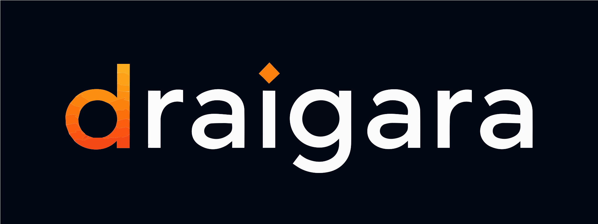

<p align="center">
  
</p>

# Forge CLI

Forge gives developers one guided machine setup for using Microsoft APM
marketplaces and the Forge plugin across supported AI coding tools. APM remains
responsible for packages, dependency resolution, deployment, and lock state.

## Start here

Forge requires Node.js 22 or newer and runs on Windows, macOS, and Linux.

Use the preview directly with your preferred package manager:

```sh
# npm
npx @draigara/forge@next setup

# pnpm
pnpm dlx @draigara/forge@next setup

# Yarn 2+
yarn dlx @draigara/forge@next setup
```

`setup` opens with the Draigara brand, reports each discovery stage, shows one
complete plan, installs the invoked Forge release on `PATH`, registers Draigara
OpenAPM Community, and asks APM to install or refresh the global Forge plugin
for the coding tools you select. If APM is missing and `uv` is available, Forge
first explains and asks to install that prerequisite, then discovers and asks
separately about the complete Forge setup plan.

Setup is safe to run again after installing another coding tool or changing
APM, marketplace, or plugin configuration:

```sh
forge setup
```

After setup, open Codex CLI, Claude Code, or GitHub Copilot CLI in a repository
and ask the Forge plugin to initialize it:

```text
/forge init
```

Codex exposes the same workflow as `$forge init` or through `/skills`. Natural
language such as “use Forge to initialize this repository” works in every
supported harness. Repository initialization belongs to the plugin; the
machine CLI intentionally has no public `forge init` command.

## Install globally yourself

`setup` normally installs Forge globally for you. To install first:

```sh
# npm
npm install --global @draigara/forge@next

# pnpm
pnpm add --global @draigara/forge@next
```

Modern Yarn intentionally has no global-install equivalent; use `yarn dlx` for
the initial setup and let Forge install itself on `PATH`.

## Commands

```text
forge setup
forge doctor
forge marketplace add|list|update|remove
forge plugin install|list|update|remove
forge --version
```

`forge mcp` is the versioned stdio integration used by the Forge plugin. It is
not an interactive human command.

## What Forge changes

- Forge displays and confirms the complete top-level plan before mutation.
- APM owns marketplace state, package installation, dependency resolution, and
  target deployment.
- Forge tracks whether it created or explicitly adopted a marketplace mapping;
  it never removes a pre-existing adopted registration from APM.
- Forge does not store credentials, package graphs, or inferred repository
  facts in its machine state.

Run `forge doctor` to inspect Node.js, APM, marketplaces, coding tools, the
Forge plugin, and recovery state without repairing anything silently.

## Project information

- [Contributing and running from source](./CONTRIBUTING.md)
- [Architecture](./docs/architecture.md)
- [Security policy](./SECURITY.md)
- [License](./LICENSE) — Apache License 2.0
- [Trademarks](./TRADEMARKS.md) — Draigara name and brand usage
